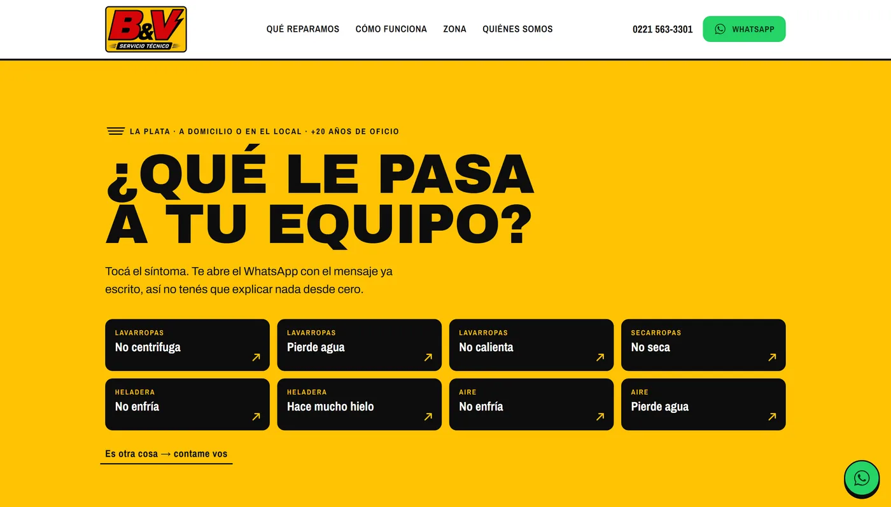

# B&V Servicio Técnico

Landing page for an appliance repair shop in La Plata, Argentina. One page, no
build step, no dependencies.

**[byvservicios.netlify.app](https://byvservicios.netlify.app/)**



---

## The idea

People whose washing machine broke do not know what to call the fault, and they
do not want to describe it to a stranger. So the page does not ask them to.

**They tap the symptom — "won't spin", "leaking water", "not cooling" — and
WhatsApp opens with the message already written.** Eight symptoms across four
appliance types, plus an escape hatch for anything else. No contact form, no
fields to fill in, no waiting for a reply by email.

That is the whole site, and everything else exists to support it: what gets
repaired, how the service works, which neighbourhoods are covered, and who is
behind it.

## Stack

Plain HTML and CSS. **Three lines of JavaScript**, and all they do is keep the
year in the footer up to date.

| | |
|---|---|
| Front end | HTML + CSS, no framework, no dependencies |
| Hosting | Netlify (static) |
| Images | WebP, quantised PNG for flat artwork |
| Local map | tiles composited at build time, no map library at runtime |

There is no runtime JavaScript to speak of because nothing on the page needs
it. The map is a flat image composited at build time, not an embedded widget.
The page loads **no external scripts at all** — no analytics, no tag manager,
no iframes, no map library. Nothing reaches a third party while a customer
reads it. The only outbound links are the ones they choose to tap: WhatsApp and
the shop's Google Maps listing.

## The tooling is the interesting part

Eleven scripts under `herramientas/`, written for this project, with no npm
dependencies. They are not a build pipeline — the site needs no build — they
are checks that answer questions that are otherwise answered by guessing:

| script | what it answers |
|---|---|
| `audit.js` | Does the layout overflow at any width? What is the real contrast? Emulates several widths over CDP and captures each one. |
| `coherencia.js` | Does every claim the site makes hold up? Cross-checks what the copy says against what the site actually does. |
| `cumplimiento.js` | Can this site prove there is a real person and a real business behind it — named owner, address, contact, structured data — and that it captures nothing? |
| `geocode.js` | Where exactly is "Calle 5 between 66 and 67"? Finds both real corners in OpenStreetMap and takes the midpoint of the block. |
| `tiles.js` · `componer-mapa.ps1` | Downloads map tiles and composites the static map, so no map library ships to the browser. |
| `quantize.js` | A PNG quantiser with no dependencies: decodes truecolor and rewrites it indexed. For flat artwork like logos, the saving is large. |
| `shot.js` · `og-imagen.ps1` · `foto-local.ps1` | Screenshots, the Open Graph image, and the shopfront photo. |
| `fuentes.js` · `red.js` · `ficha.js` · `resolver.js` | Font subsetting, network checks, business listing data. |

`herramientas/LEEME.md` documents all of them, in Spanish.

## Running it locally

```bash
python -m http.server 8123
```

Any static server works. There is nothing to install and nothing to compile.

## Deploying

`para-subir/` holds the copy that goes to Netlify — the site plus `_headers`,
`_redirects`, `robots.txt` and `sitemap.xml`. `docs/COMO-SUBIR.txt` covers the
steps and what to verify afterwards.

Most of that folder is regenerated by syncing from the root, so it is
gitignored — except five files that live only there and cannot be derived,
which are pinned in `.gitignore` on purpose. One of them is the Search Console
verification file: delete it and Google revokes the verification.

## Privacy

`privacidad/index.html` is a real privacy policy, not boilerplate. It can be
short and specific because the site genuinely collects nothing: no forms, no
analytics, no third-party embeds. `cumplimiento.js` exists to keep that
statement true — if someone adds a tracker later, the check fails.

---

Built for B&V Servicio Técnico. The code is here to be read; the branding and
the photographs are the shop's.
